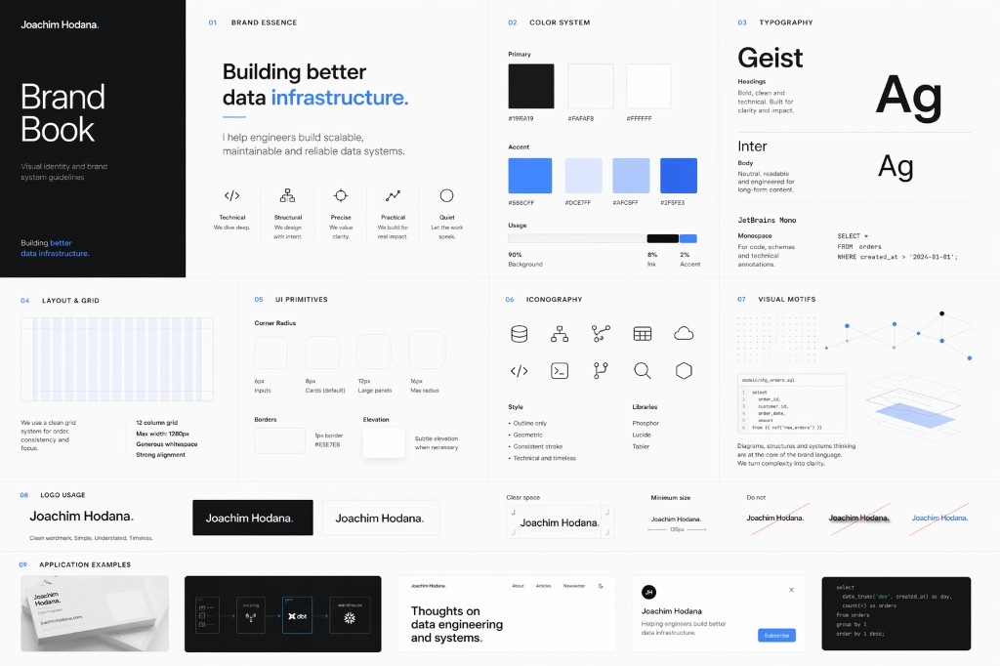

# Brand System Specification — Joachim Hodana / Better Data Engineer

## Overview

Design a personal brand system that feels like a blend of:
- technical research lab
- premium minimalist software company
- quiet engineering craftsmanship

Reference aesthetic:
- Linear
- Snowflake
- Stripe (restraint, not gradients-heavy)
- Vercel-level minimalism

Avoid:
- generic startup SaaS visuals
- loud “tech influencer” aesthetics
- excessive color
- glossy 3D illustrations
- overdesigned dashboards
- crypto/cyberpunk visuals
- playful rounded consumer UI

Brand personality:
- Precise
- Structural
- Quiet
- Technical
- Premium

Tone should signal:
“serious systems engineer”

---

## Color System

### Core Palette

Primary ink:
- `#191919`

Background:
- `#FAFAF8` (preferred)
- `#FFFFFF` (secondary)

Primary accent (signature color):
- Ice Blue `#5B8CFF`

Accent scale:
- `#DCE7FF` (soft tint)
- `#AFC5FF` (mid tint)
- `#2F5FE3` (dark interactive state)

Color ratio:
- 90% light backgrounds
- 8% ink
- 2% accent blue

Rules:
- mostly monochrome
- use accent sparingly
- blue used as signal, not decoration
- no rainbow palettes
- no multiple accent colors

---

## Typography

### Headings

Use:
- Geist (primary)

Style:
- large editorial headings
- slightly tight tracking
- strong hierarchy
- minimal words

Examples:
- large bold hero titles
- understated section headers
- strong whitespace around typography

### Body/UI

Use:
- Inter

Style:
- neutral
- readable
- understated
- engineering-grade clarity

### Monospace (technical annotations only)

Use one:
- JetBrains Mono
- IBM Plex Mono

Use for:
- code snippets
- schema labels
- annotations
- data model notes

Never use monospace as body font.

---

## Layout Philosophy

Use:
- Swiss grid discipline
- asymmetrical but balanced layouts
- generous whitespace
- strong alignment
- editorial spacing

Feel:
calm, intentional, architectural

Avoid:
- clutter
- noisy cards
- marketing sections overloaded with elements

---

## Radius / UI Primitives

Corner radius system:
- 6px inputs
- 8px standard cards (default)
- 12px large panels
- 16px maximum

Default:
8px

Rules:
- avoid bubbly SaaS rounding
- prefer sharper premium geometry
- restrained modernism

---

## Borders and Surfaces

Use subtle borders:
- 1px
- low contrast

Surface treatment:
- mostly flat
- light elevation only when necessary
- avoid heavy shadows

Prefer:
- linework
- structure
- grids
over decoration

---

## Iconography

Style:
- outline only
- geometric
- light stroke
- consistent weight

Libraries:
- Phosphor
- Lucide
- Tabler

No filled icons.  
No playful illustrations.

Icon themes should relate to:
- data lineage
- DAGs
- nodes
- schemas
- infrastructure
- systems topology

---

## Visual Motifs

Core brand motifs:
- node-link diagrams
- warehouse/data flow diagrams
- subtle dot grids
- blueprint-like system drawings
- structured graph patterns
- technical line compositions

These motifs should act almost as a logo system.

Think:
“infra diagrams as branding”

Avoid generic cloud clipart.

---

## Logo Direction

No traditional logo mark needed.

Prefer:
minimal wordmark:

`Joachim Hodana.`

or subtle monogram:
`jh`

Style:
- understated
- typographic
- premium
- quiet

No mascot.  
No symbolic database icons.  
No obvious “pipeline” logos.

---

## Imagery Direction

Use imagery that feels:
- editorial
- architectural
- technical
- sparse

Could include:
- abstract infrastructure diagrams
- system maps
- minimal code fragments
- monochrome technical compositions

Avoid:
- stock office photos
- smiling people
- fake dashboards
- neon AI imagery

---

## LinkedIn / Website / Newsletter Consistency

All touchpoints should share:
- same color system
- same type system
- same spacing logic
- same iconography
- same visual motifs

Should feel like one operating system.

---

## Keywords for all outputs

Every design decision should optimize for:
- Precise
- Structural
- Quiet
- Technical
- Premium

If something feels trendy, flashy, playful, or loud:
remove it.

---

## Creative Prompt Summary

Design as if building a visual identity for a boutique data infrastructure research studio run by a systems engineer.

Mood:
- minimal white surfaces
- ink-black typography
- ice-blue signal accents
- Swiss precision
- research-lab diagrams
- premium software restraint

Not startup.  
Not agency.  
Not creator economy.

Infrastructure craftsmanship.

